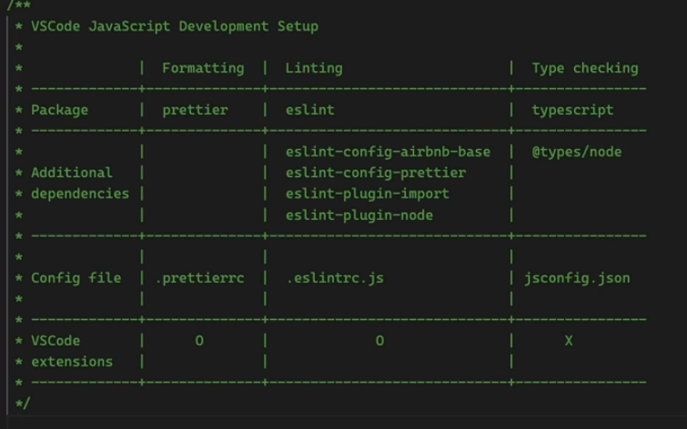

# memo 

### type check 
1. npm install --save-dev typescript 설치 후
2. <span style="background-color:#ff7b72;">// @ts-check</span> 문서의 맨 윗줄에 작성해줌. <br/>
<span style = "color:grey;">-- 노드 환경에서 사용해주기 위해 3번 패키지를 설치 </span>
3. npm install --save-dev @types/node 


<span style = "color:grey;">[출처] fastCampus 한번에 끝내는 node.js 웹프로그래밍</span>
<br/><br/>
### javascript basic
 - 자바스크립트 코드가 실행되는 스레드를 메인 스레드라 한다.
 - 한 Node.js 프로세스에서 메인 스레드는 하나이며, 한 순간에 한줄씩만 실행한다.
 - 콜스택 ?<br/>
   지금 시점까지 불린 함수들의 스택 <br/>
   
 - 자바스크립트의 동시성 모델 
 - Event Loop    

 - hoisting <br/>
   : 변수의 선언 만을 해당 스코프 맨 위로 끌어올리는 것을 뜻함 <br/>
    &nbsp;&nbsp;function도 hoisting의 대상이다. 
   ```
   console.log(x) 
   var x = 1 

    두 개의 코드는 동일 하다.

   var x 
   console.log(x)
   x = 1
   // 출력 결과 : undefined
   ```

   ```
   function foo(){ 
       return 'foo'
   }
   console.log(foo())

    위 두 코드의 실행 결과는 똑같다. 

   console.log(foo()) 
   function foo(){ 
       return 'foo'
   }
   ```

- scope <br/>
  간단히 설명하면 {}로 묶여 있는 영역 

- binding <br/>
 코드의 어떤 식별자가 실제로 어떤 값을 가리키는 지 결정 하는 것 

- closure <br/>
 closure = function + environment <br/>
 closure은 function이 하나 생길 때마다 하나씩 생긴다. <br/>
 environment는 함수 자신을 둘러싼, 접근 할 수 있는 모든 스코프를 뜻한다. 

 
